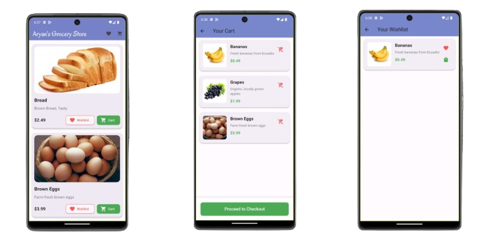

# Grocery shopping cart app

This is a basic grocery shopping app with basic functionalities of add to cart and add grocery to wishlist.

The purpose of this app is to demonstrate the use of BLOC state management for my own practice. Please feel free to leave a feedback. 

## Screenshots

## Acknowledgements

I have created this by following the Flutter Bloc tutorial video of Akshit Madan.
 - [Akshit Madan's Bloc tutorial](https://www.youtube.com/watch?v=Y1roIi0-Sro&list=PL9n0l8rSshSkzasAAyVMozHQu8-LdWxI0)

